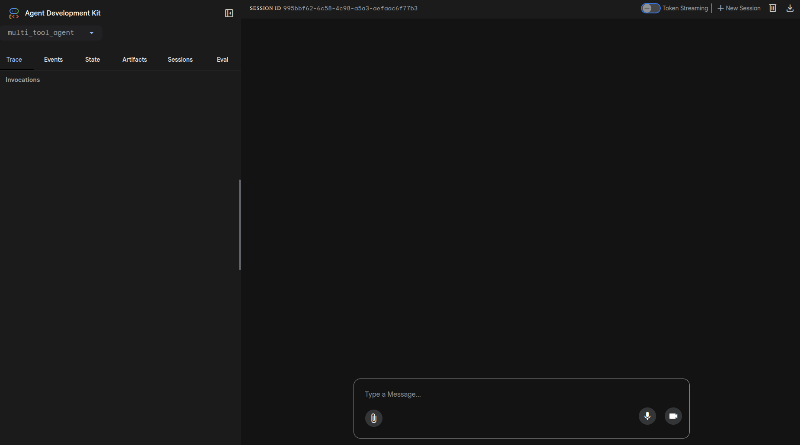
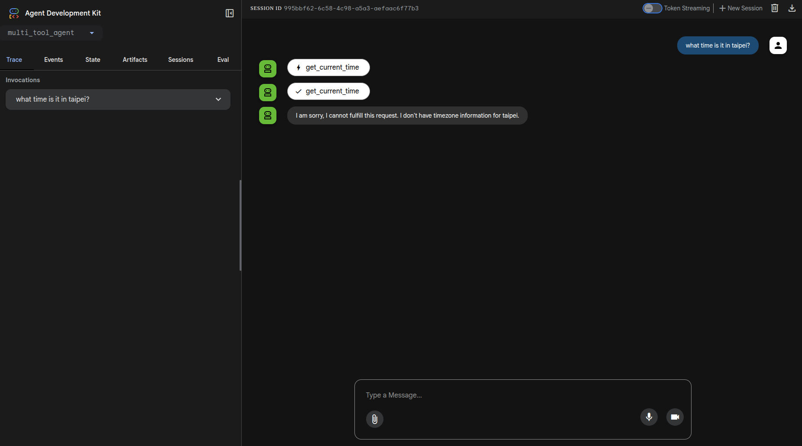

<!-- omit in toc -->
# Test - Google ADK Quick Start

<!-- omit in toc -->
## Table of contents

- [App Screenshots](#app-screenshots)
- [Steps](#steps)
- [Note](#note)
- [Resources](#resources)

## App Screenshots





## Steps

- Setup env & install ADK.

  ```bash
  mkdir TestGoogleAdkQuickStart
  cd TestGoogleAdkQuickStart
  python -m venv .venv
  source .venv/bin/activate
  pip list
  pip install google-adk
  ```

- Create agent project.

  ```bash
  mkdir multi_tool_agent/
  echo "from . import agent" > multi_tool_agent/__init__.py
  touch multi_tool_agent/agent.py
  touch multi_tool_agent/.env
  ```

  - Note for Windows users
    - When using ADK on Windows for the next few steps, we recommend creating Python files using File Explorer or an IDE because the following commands (mkdir, echo) typically generate files with null bytes and/or incorrect encoding.

- Setup the model

  ```txt
  # multi_tool_agent/.env
  GOOGLE_GENAI_USE_VERTEXAI=FALSE
  GOOGLE_API_KEY=PASTE_YOUR_ACTUAL_API_KEY_HERE
  ```

- Run the Agent.

  ```bash
  cd TestGoogleAdkQuickStart
  adk web
  ```

  - Open the URL. (`http://localhost:8000` or `http://127.0.0.1:8000`)

## Note

## Resources

- Google ADK
  - [Quickstart](https://google.github.io/adk-docs/get-started/quickstart/)
