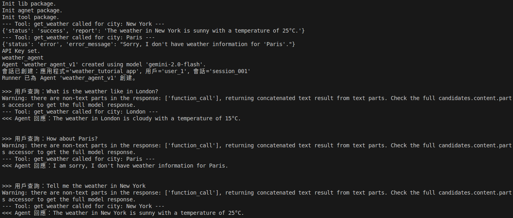

<!-- omit in toc -->
# Test - Google ADK Tutorials

<!-- omit in toc -->
## Table of contents

- [Target](#target)
- [App Screenshots](#app-screenshots)
- [Steps](#steps)
- [Note](#note)
- [Resources](#resources)

## Target

- Build a weather bot agent team.
- Learn how to structure interactions, manage state, ensure safety, and orchestrate multiple AI "brains" working together.

## App Screenshots



## Steps

- Setup env & install ADK.

  ```bash
  mkdir TestGoogleAdkTutorials
  cd TestGoogleAdkTutorials
  touch requirements.txt
  python -m venv .venv
  source .venv/bin/activate
  pip list
  pip install -r ./requirements.txt
  pip freeze > requirements_freeze.txt
  ```

- Create python file.
- Import necessary libraries.
- Configure API keys.

  ``` python
  from dotenv import load_dotenv

  load_dotenv()
  ```

- Define model constants.

  ``` python
  MODEL_GEMINI_2_0_FLASH = "gemini-2.0-flash"
  ```

## Note

- System description:
  - Leveraging different AI models (Gemini, GPT, Claude).
  - Multi-agent system. Designing specialized sub-agents for distinct tasks (like greetings and farewells).
  - Enabling intelligent delegation between agents.
  - Giving agents memory using persistent session state.
  - Implementing crucial safety guardrails using callbacks.
- **ADK** is a Python framework designed to streamline the development of applications powered by Large Language Models (LLMs). It offers robust building blocks for creating agents that can reason, plan, utilize tools, interact dynamically with users, and collaborate effectively within a team.
- ADK makes switching between models seamless through its integration with the **LiteLLM** library. LiteLLM acts as a consistent interface to over 100 different LLMs.

## Resources

- Google ADK
  - [Get Started](https://google.github.io/adk-docs/get-started/)
    - [ADK Tutorials!](https://google.github.io/adk-docs/tutorials/)
    - [Build Your First Intelligent Agent Team: A Progressive Weather Bot with ADK](https://google.github.io/adk-docs/tutorials/agent-team/)
- Google AI for Developers
  - [All models](https://ai.google.dev/gemini-api/docs/models)
- Google AI Studio
  - [API Keys](https://aistudio.google.com/app/apikey)
